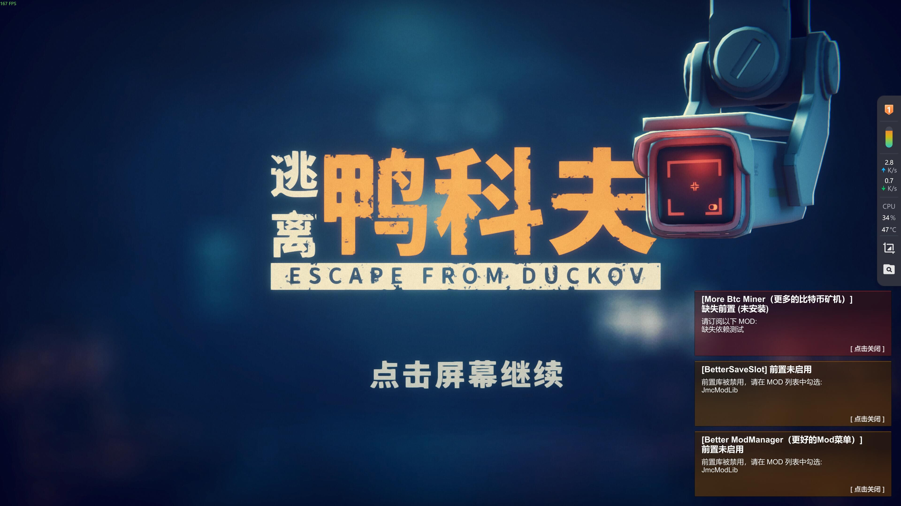
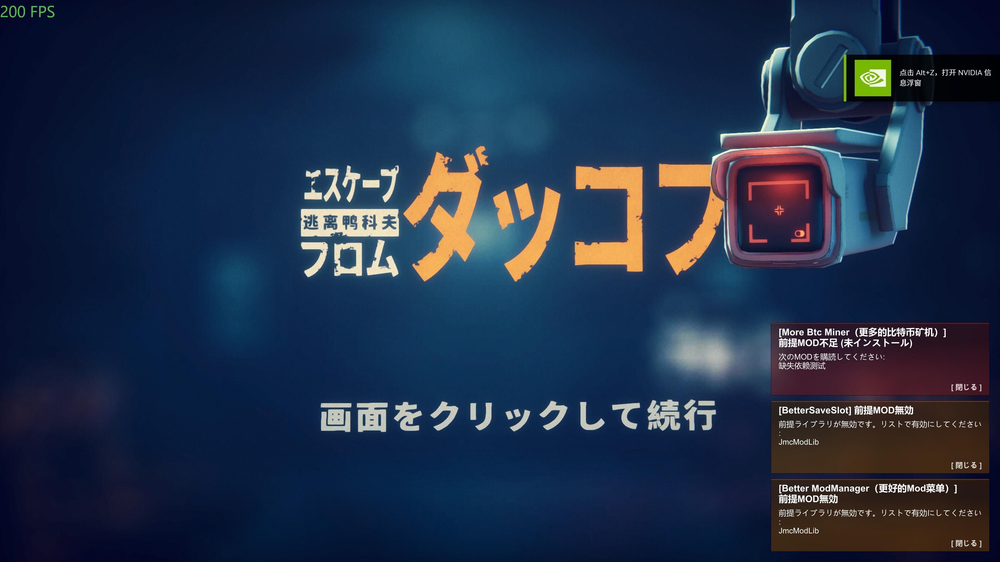
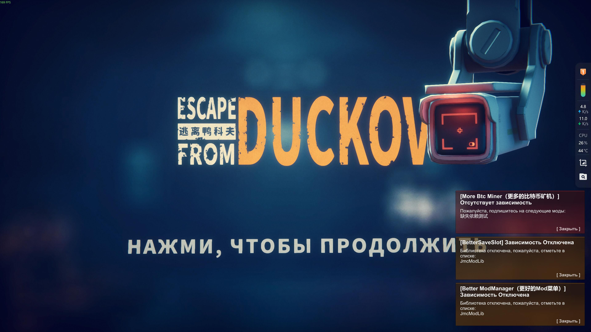

**🌐[ [Chinese](README.md) | English ]**

[📝Changelog](CHANGELOG.md)

[📦 Releases](https://github.com/JMC2002/ModTemplate)

# Code Template
## 1. About .csproj
Derived from [ModTemplate.csproj](ModTemplate.csproj).

You only need to modify the following parts. Once configured, you can copy-paste this for every new MOD on this computer:
```xml
    <!-- Duckov Install Path -->
    <DuckovPath>D:\SteamLibrary\steamapps\common\Escape from Duckov</DuckovPath>

    <!-- Managed DLL Directory -->
    <DuckovManagedPath>$(DuckovPath)\Duckov_Data\Managed</DuckovManagedPath>

    <!-- Mods Directory -->
    <DuckovModPath>$(DuckovPath)\Duckov_Data\Mods\</DuckovModPath>
    <!-- Mods folder under the project root directory -->
    <ModLocalDir>$(ProjectDir)$(ModName)</ModLocalDir>
    <!-- Game Mods folder -->
    <ModGameDir>$(DuckovModPath)$(ModName)</ModGameDir>
    <!-- Steam Workshop folder -->
    <SteamWorkShop>D:\SteamLibrary\steamapps\workshop\content\3167020\</SteamWorkShop>
    <!-- File containing version info, extracts info like Version = x.x.x -->
    <ModVersionFile>$(ProjectDir)Core\VersionInfo.cs</ModVersionFile>
    <Configurations>Debug;Release</Configurations>

  </PropertyGroup>
  ```

If you want to depend on Workshop files, do it like this:
```xml
    <Reference Include="JmcModLib">
      <HintPath>$(SteamWorkShop)3613297900\JmcModLib.dll</HintPath>
    </Reference>
```
Specifically, for `JmcModLib`, I am referencing the local version here. If you need to reference this library, please change it to the Workshop version (i.e., the lines commented out below).


Then, create a `Core` folder in your project directory and create a `VersionInfo.cs` file inside it with the following content:
```csharp
  
namespace ModTemplate.Core
{
    internal static class VersionInfo
    {
        internal const string Name = "ModTemplate";
        internal const string Version = "1.0.0";
    }
}
```
Building the project will automatically extract the version number and Mod name from it (file path and name can be modified via `ModVersionFile` above).

The build process will do the following:
- Extract the version number and Mod name from the aforementioned file, add the top-level MOD name and author name, and inject them into the DLL.
- Generate the DLL.
- Copy the DLL to the `ModName` folder under the root directory (defaults to the same name as the project file).
- Incrementally copy the `ModName` folder from the root directory to the `Duckov_Data\Mods\ModName` folder in the game installation directory (it will be created if it doesn't exist). Therefore, it is recommended to maintain `.ini` files, avatars, and similar info here.
- Once everything is complete, a popup will ask if you want to launch the game.

## 2. About Order-Independent Dependencies
If your MOD strongly depends on DLLs from other MODs (not limited to JmcModLib), you can use the method in this project to eliminate the need for a specific load order.
- First, copy [DependencyModLoader.cs](Core/DependencyModLoader.cs) to your project. You can access the current loader version via `LOADER_VERSION` for compatibility checks.
- Then, replace your entry point `ModBehaviour.cs` with this project's [ModBehaviour.cs](ModBehaviour.cs) and modify the `DependencyNames` property inside. Add the names of the MODs you depend on. This ensures your MOD loads only after those MODs have finished loading, avoiding issues like missing types due to incorrect load order.
- Meanwhile, implement your original ModBehaviour logic in [ModBehaviourImpl.cs](Core/ModBehaviourImpl.cs).
- Remember to rename the namespace to your own to prevent naming conflicts.

After doing this, the following effects will be observed:
- Your MOD will load only after the dependent MODs have completed loading.
- If a prerequisite is not installed, a red popup will appear in the bottom right corner warning that the prerequisite is missing, and the MOD will stop loading its actual logic.
- If a prerequisite is installed but not checked (enabled), a yellow popup will appear in the bottom right corner warning that the prerequisite is not enabled.
- If the prerequisite is installed (regardless of whether it is checked), the MOD will start listening and wait until all prerequisites are fully loaded before loading the actual logic DLL.

About popup attributes:
- The bottom-right popup can be closed by clicking. It will also disappear automatically after you check the prerequisite (if it doesn't disappear, you might need to uncheck and re-check the prerequisite).
- The popup supports automatic localization.
- When a required dependency is missing (i.e., the red notification) and the corresponding Steam Workshop ID is provided, clicking the notification will redirect you to the relevant Workshop subscription page to make subscribing easier.  
  If only one dependency is missing, it will be opened directly via Steam; if more than one is missing, they will be opened in the in-game overlay browser.  
  For non-Steam users, the links will be opened directly in an external web browser.
- It is not recommended to modify the code in `DependencyModLoader.cs` unless you clearly know what you are doing.






## 3. Communication and Feedback
- This project is affiliated with [JmcModLib](https://github.com/JMC2002/JmcModLib) ([Workshop](https://steamcommunity.com/sharedfiles/filedetails/?id=3613297900)). If you have any feedback or suggestions, in addition to opening an Issue in this project, you can also post them in the comments section of the Workshop page.
- If you use the `DependencyModLoader` from this project, please let me know so that I can notify you of potential future updates.
- [Click to join QQ Group (617674584)](http://qm.qq.com/cgi-bin/qm/qr?_wv=1027&k=Kii1sz9bmNmgEgnmsasbKn6h3etgSoQR&authKey=Hni0nbFlbd%2BfDZ1GoklCdtHw4r79SuEsHvz9Pi4qs020w1f8D2DHD8EEnNN1OXo6&noverify=0&group_code=617674584)
- [Discord Link](https://discord.gg/pnrpRmU2)